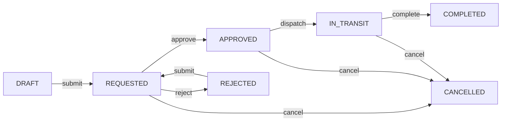

# Transfer Workflow API: Frontend Integration Guide

_Last updated: October 2, 2025_

This guide explains how the backend transfer workflow works and how frontend clients can interact with it. Use it as the primary reference when wiring warehouse→storefront transfer features in the UI.

---

## 1. Domain overview

### 1.1 Key models

| Model | Purpose | Highlights |
| ----- | ------- | ---------- |
| `Transfer` | Represents a warehouse → storefront movement request. | Tracks business, source warehouse, destination storefront, lifecycle timestamps, and overall status. |
| `TransferLineItem` | Child rows for individual products and requested quantities. | Captures requested, approved, and fulfilled quantities plus notes/unit-of-measure. |
| `TransferAuditEntry` | History log for state transitions and edits. | Automatically recorded when the transfer is created or changes state. |
| `StoreFrontInventory` | Denormalized stock levels at the storefront. | Automatically incremented when a transfer completes. |
| `TransferRequest` | Storefront-originated stock request awaiting fulfilment. | Links storefront demand to transfers; tracks requester, priority, status, and linked transfer metadata. |

### 1.2 Status lifecycle

Transfers move through the following states. Only the listed transitions are allowed:



**Editable states:** `DRAFT`, `REJECTED`

**Deletion:** only allowed while draft or rejected.

### 1.3 Transfer request lifecycle

Transfer requests operate alongside transfers to capture storefront demand before a manager assembles a shipment. Requests transition through:

| Status | Description | Allowed next states |
| ------ | ----------- | ------------------- |
| `NEW` | Request has been submitted by storefront staff. | `ASSIGNED`, `CANCELLED` |
| `ASSIGNED` | A transfer is linked and in progress. | `FULFILLED`, `CANCELLED` |
| `FULFILLED` | Requester (or delegated manager) confirmed delivery. | — |
| `CANCELLED` | Request withdrawn prior to fulfilment. | — |

Each request exposes `linked_transfer` and `linked_transfer_reference` for deep-linking back to the transfer detail view.

---

## 2. Authentication & permissions

All endpoints live under the authenticated namespace: `/inventory/api/…` and require a valid session or token (standard DRF auth).

Business scoping is enforced server-side:

- Users must belong to the transfer's business. Superusers/platform admins bypass checks.
- Creating transfers requires membership in the source warehouse's business.
- Approvals, dispatches, completion, and cancellation are limited to roles `{OWNER, ADMIN, MANAGER}`.
- Rejections also require the manager role set.
- Storefront staff with `inventory.requests.create` can submit transfer requests; managing or cancelling them requires `inventory.requests.manage`.
- Confirming delivery on a transfer linked to a request requires either the original requester or roles granted `inventory.transfers.confirm`.

If a user lacks permissions, the API responds with `403 Forbidden`.

---

## 3. Base resources

### 3.1 Collection endpoint

```
GET /inventory/api/transfers/
```

#### Supported query params

| Parameter | Type | Notes |
| --------- | ---- | ----- |
| `status` | string | Filter by lifecycle state. |
| `source_warehouse` | UUID | Filter by warehouse ID. |
| `destination_storefront` | UUID | Filter by storefront ID. |
| `search` | string | Matches `reference`, product name, or SKU. |
| `ordering` | string | One of `created_at`, `updated_at`, `reference`. Prefix with `-` for descending. |
| `page`, `page_size` | numbers | Standard pagination controls. Defaults: page 1, size 25 (max 100). |

#### Response schema (TransferSerializer)

```jsonc
{
  "id": "uuid",
  "reference": "TRF-20251002-ABC123",
  "business": "uuid",
  "status": "REQUESTED",
  "source_warehouse": "uuid",
  "source_warehouse_name": "Main Warehouse",
  "destination_storefront": "uuid",
  "destination_storefront_name": "Downtown Store",
  "notes": "optional notes",
  "requested_by": "uuid",
  "requested_by_name": "Alice Manager",
  "approved_by": "uuid|null",
  "approved_by_name": "string|null",
  "fulfilled_by": "uuid|null",
  "fulfilled_by_name": "string|null",
  "submitted_at": "2025-10-02T09:31:03Z",
  "approved_at": null,
  "dispatched_at": null,
  "completed_at": null,
  "rejected_at": null,
  "cancelled_at": null,
  "line_items": [
    {
      "id": "uuid",
      "product": "uuid",
      "product_name": "Sparkle Orange Juice",
      "product_sku": "SP-ORJ-500",
      "requested_quantity": 25,
      "approved_quantity": null,
      "fulfilled_quantity": null,
      "unit_of_measure": "bottle",
      "notes": null
    }
  ],
  "audit_log": [
    {
      "id": "uuid",
      "action": "CREATED",
      "actor": "uuid",
      "actor_name": "Alice Manager",
      "remarks": "Seeded transfer",
      "created_at": "2025-10-02T09:30:00Z"
    }
  ],
  "created_at": "2025-10-02T09:30:00Z",
  "updated_at": "2025-10-02T09:31:03Z"
}
```

### 3.2 Detail endpoint

```
GET /inventory/api/transfers/{transferId}/
```

Returns the same payload as the list, including nested line items and audit log.

### 3.3 Transfer request endpoints

Transfer requests capture storefront demand before a transfer exists. Endpoints (all authenticated) live under `/inventory/api/transfer-requests/`:

| Method & path | Purpose | Notes |
| ------------- | ------- | ----- |
| `GET /transfer-requests/` | List requests the user can view. | Supports standard pagination and filtering by `status`, `storefront`, and `priority`. |
| `POST /transfer-requests/` | Create a new request. | Accepts `storefront`, optional `priority`, `notes`, and `line_items` (`product`, `requested_quantity`, optional `unit_of_measure`, `notes`). Defaults status to `NEW`. |
| `GET /transfer-requests/{id}/` | Retrieve a request with line items. | Includes `linked_transfer` metadata when present. |
| `PATCH /transfer-requests/{id}/` | Update metadata or link to an existing transfer. | Managers can adjust `priority`, add internal notes, or set `linked_transfer`. Status changes must respect the lifecycle table above. |
| `POST /transfer-requests/{id}/cancel/` | Cancel an open request. | Allowed while `NEW`; managers can also cancel `ASSIGNED` requests. |
| `POST /transfer-requests/{id}/fulfill/` | Mark the request fulfilled. | Requires a linked transfer in `COMPLETED`. Records `fulfilled_by` and `fulfilled_at`.

When a transfer is linked, the request moves from `NEW` → `ASSIGNED`. Once the transfer reaches `COMPLETED` and the requester confirms delivery, call `fulfill` to transition to `FULFILLED`.

---

## 4. Creating and editing transfers

### 4.1 Create draft

```
POST /inventory/api/transfers/
Content-Type: application/json
```

Request body:

```json
{
  "source_warehouse": "uuid",
  "destination_storefront": "uuid",
  "notes": "Optional note for the warehouse team",
  "request_id": "uuid",
  "line_items": [
    {
      "product": "uuid",
      "requested_quantity": 25,
      "unit_of_measure": "carton",
      "notes": "Keep refrigerated"
    }
  ]
}
```

Rules:

- `line_items` must not be empty.
- Each line item needs a positive `requested_quantity`.
- Products must belong to the same business as the warehouse and storefront.
- `request_id` is optional. When provided, the backend verifies the request is still actionable (`NEW`/`ASSIGNED`), links the transfer, and (when `line_items` are omitted) clones items from the request. Successful linking moves the request to `ASSIGNED` and populates `linked_transfer_reference`.
- Upon creation, `requested_by` auto-populates with the authenticated user, `status` defaults to `DRAFT`, and a unique `reference` is generated.

### 4.2 Update draft/rejected transfers

```
PATCH /inventory/api/transfers/{transferId}/
```

Payload rules:

- Only allowed while `status` is `DRAFT` or `REJECTED` (`transfer.is_editable`).
- Updating `line_items` uses the same structure as create. To delete a line, include `{"id": "uuid", "_destroy": true}`.
- Other mutable fields: `destination_storefront`, `source_warehouse`, `notes` (only in editable states).

### 4.3 Delete draft/rejected transfers

```
DELETE /inventory/api/transfers/{transferId}/
```

Returns `204 No Content` on success. Non-editable statuses raise a validation error.

### 4.4 Real-time stock availability probe

While composing a transfer, use the lightweight probe to ensure requested quantities can be reserved:

```
GET /inventory/api/stock/availability/?warehouse=<uuid>&product=<uuid>&quantity=<integer>
```

Response payload:

```json
{
  "warehouse": "uuid",
  "product": "uuid",
  "requested_quantity": 12,
  "available_quantity": 42,
  "is_available": true,
  "message": "Sufficient stock on hand."
}
```

- Calculations consider on-hand inventory minus quantities reserved by pending transfers (`REQUESTED`/`APPROVED`).
- When `is_available` is `false`, `message` explains the shortfall (e.g. "Only 4 units available at Main Warehouse.").
- Permission checks mirror transfer creation: only members of the warehouse's business (or platform admins) can see availability.

---

## 5. Workflow actions

All workflow transitions are exposed as detail routes under the transfer resource and accept `POST` requests. Responses always return the full, updated transfer payload.

| Action | Endpoint | Allowed from | Required role | Purpose | Optional payload |
| ------ | -------- | ------------ | ------------- | ------- | ---------------- |
| **Submit** | `/inventory/api/transfers/{id}/submit/` | `DRAFT`, `REJECTED` | Member | Move draft to `REQUESTED`. Requires at least one line item. | _none_ |
| **Approve** | `/inventory/api/transfers/{id}/approve/` | `REQUESTED` | Owner/Admin/Manager | Capture approvals and optionally adjust `approved_quantity`. | `{ "line_items": [{ "id": "uuid", "approved_quantity": 20 }] }` |
| **Reject** | `/inventory/api/transfers/{id}/reject/` | `REQUESTED` | Owner/Admin/Manager | Reject with reason. Transfer becomes editable again. | `{ "reason": "Insufficient stock" }` (required) |
| **Dispatch** | `/inventory/api/transfers/{id}/dispatch/` | `APPROVED` | Owner/Admin/Manager | Deduct inventory from warehouse, set `IN_TRANSIT`, optionally adjust `fulfilled_quantity`. | `{ "line_items": [{ "id": "uuid", "fulfilled_quantity": 18 }] }` |
| **Complete** | `/inventory/api/transfers/{id}/complete/` | `IN_TRANSIT` | Owner/Admin/Manager | Increment storefront inventory, mark `COMPLETED`. | `{ "line_items": [{ "id": "uuid", "fulfilled_quantity": 18 }] }` |
| **Cancel** | `/inventory/api/transfers/{id}/cancel/` | `REQUESTED`, `APPROVED`, `IN_TRANSIT` | Owner/Admin/Manager | Abort the transfer. If `IN_TRANSIT`, warehouse quantities are restored. | `{ "reason": "Driver unavailable" }` (optional) |
| **Confirm Receipt** | `/inventory/api/transfers/{id}/confirm-receipt/` | `IN_TRANSIT`, `COMPLETED` | Original requester or confirm-capable roles | Record delivery acknowledgement, set `received_by`/`received_at`, and (when linked) advance the request to `FULFILLED`. | `{ "notes": "All cartons delivered intact" }` (optional) |

### Notes on quantity adjustments

- **Approve**: Update `approved_quantity`; defaults to `requested_quantity` if omitted.
- **Dispatch/Complete**: Update `fulfilled_quantity`. If omitted, it falls back to `approved_quantity` or `requested_quantity`.
- Negative or missing `id` entries trigger validation errors.

---

## 6. Audit trail

Every state change creates a `TransferAuditEntry` and appears inside the `audit_log` array (read-only). The `action` field is one of:

`CREATED`, `SUBMITTED`, `APPROVED`, `REJECTED`, `CANCELLED`, `DISPATCHED`, `COMPLETED`, `UPDATED`.

Use these entries to render a timeline or activity feed in the UI.

---

## 7. Related resources for UI population

| Endpoint | Purpose |
| -------- | ------- |
| `GET /inventory/api/warehouses/?ordering=name` | Populate warehouse dropdowns (auto-filtered to the current user’s businesses). |
| `GET /inventory/api/storefronts/?ordering=name` | Populate storefront selection. |
| `GET /inventory/api/products/?search=` | Locate products when building line items. |
| `GET /inventory/api/inventory/?warehouse=<id>&product=<id>` | Optional: show available on-hand stock before approving. |
| `GET /inventory/api/stores` (via `StoreFrontInventory` admin or custom view when exposed) | Surface storefront inventory after completion. |
| `GET /inventory/api/transfer-requests/` | Power storefront request dashboards and provide linkage context. |

---

## 8. Error handling & validation cues

| Scenario | Response | Tips for frontend |
| -------- | -------- | ---------------- |
| Not a business member | `403 Forbidden` with `{ "detail": "You are not a member of this business." }` | Redirect to access request or show permission message. |
| Invalid transition | `400 Bad Request` with `{ "status": ["Invalid transition from ..."] }` | Disable UI buttons for illegal transitions. |
| Missing reason on reject | `400 Bad Request` with `{ "reason": ["This field is required."] }` | Require reason textarea before submission. |
| Missing line items on submit | `400 Bad Request` with `{ "line_items": ["At least one line item is required before submission."] }` | Validate client-side. |
| Insufficient stock upon dispatch | `400 Bad Request` with `{ "line_items": ["Insufficient stock for ..."] }` | Surface warehouse availability and allow adjustments. |
| Transfer request not eligible for linkage | `400 Bad Request` with `{ "request_id": ["Request is already fulfilled or cancelled."] }` | Disable linkage once the request leaves `NEW`/`ASSIGNED`. |
| Confirm receipt before dispatch | `400 Bad Request` with `{ "detail": "Transfer must be in transit or completed before confirming receipt." }` | Hide the confirm CTA until the transfer is `IN_TRANSIT`. |

All validation errors follow DRF’s standard structure (field → list of messages).

---

## 9. Suggested frontend flow

1. **Request submission (optional)**
  - Storefront staff raise a request via `POST /transfer-requests/`, capturing desired products and quantities.
  - Managers triage requests from `GET /transfer-requests/`, adjusting priority or linking an existing transfer when available.
2. **Draft creation**
  - Prefetch warehouses, storefronts, and product catalog.
  - Collect line items and save a draft transfer via `POST /transfers/`, optionally including `request_id` to auto-link.
3. **Review & submit**
  - Allow the creator to tweak the draft, then call `/submit/`.
4. **Approval step** (owner/admin/manager)
  - Display requested quantities and warehouse stock context.
  - Provide controls for `approved_quantity` per line item before invoking `/approve/`.
5. **Dispatch**
  - On warehouse team action, optionally capture actual packed quantities and call `/dispatch/`.
6. **In-transit monitoring**
  - Show `IN_TRANSIT` transfers with ability to complete or cancel.
7. **Completion**
  - When goods arrive, confirm quantities and call `/complete/`; storefront inventory updates automatically.
8. **Receipt confirmation**
  - The original requester (or manager) calls `/confirm-receipt/` and then `/transfer-requests/{id}/fulfill/` to close the loop.
9. **Audit visibility**
  - Render the `audit_log` entries to show actor, action, timestamp, and remarks.

---

## 10. Reference: Transfer schema (for TypeScript consumers)

```ts
export interface Transfer {
  id: string;
  reference: string;
  business: string;
  status: 'DRAFT' | 'REQUESTED' | 'APPROVED' | 'IN_TRANSIT' | 'COMPLETED' | 'REJECTED' | 'CANCELLED';
  source_warehouse: string;
  source_warehouse_name: string;
  destination_storefront: string;
  destination_storefront_name: string;
  notes: string | null;
  requested_by: string;
  requested_by_name: string;
  request_id: string | null;
  request_reference?: string | null;
  approved_by: string | null;
  approved_by_name: string | null;
  fulfilled_by: string | null;
  fulfilled_by_name: string | null;
  received_by: string | null;
  received_by_name: string | null;
  received_at: string | null;
  submitted_at: string | null;
  approved_at: string | null;
  dispatched_at: string | null;
  completed_at: string | null;
  rejected_at: string | null;
  cancelled_at: string | null;
  line_items: TransferLineItem[];
  audit_log: TransferAuditEntry[];
  created_at: string;
  updated_at: string;
}

export interface TransferLineItem {
  id: string;
  product: string;
  product_name: string;
  product_sku: string;
  requested_quantity: number;
  approved_quantity: number | null;
  fulfilled_quantity: number | null;
  unit_of_measure: string | null;
  notes: string | null;
}

export interface TransferAuditEntry {
  id: string;
  action: 'CREATED' | 'SUBMITTED' | 'APPROVED' | 'REJECTED' | 'CANCELLED' | 'DISPATCHED' | 'COMPLETED' | 'UPDATED';
  actor: string | null;
  actor_name: string | null;
  remarks: string | null;
  created_at: string;
}

export interface TransferRequestLineItem {
  id: string;
  product: string;
  product_name?: string;
  sku?: string | null;
  requested_quantity: number;
  unit_of_measure?: string | null;
  notes?: string | null;
}

export interface TransferRequest {
  id: string;
  business: string;
  storefront: string;
  storefront_name?: string;
  requested_by: string;
  requested_by_name?: string;
  status: 'NEW' | 'ASSIGNED' | 'FULFILLED' | 'CANCELLED';
  priority?: 'LOW' | 'MEDIUM' | 'HIGH';
  notes?: string | null;
  linked_transfer?: string | null;
  linked_transfer_reference?: string | null;
  fulfilled_at?: string | null;
  fulfilled_by?: string | null;
  line_items: TransferRequestLineItem[];
  created_at: string;
  updated_at: string;
}
```

---

## 11. Future enhancements (for awareness)

- API surface currently doesn’t expose `StoreFrontInventory` via REST; consider adding if the frontend needs direct storefront stock lookup.
- Notifications/webhooks are not yet implemented; frontend should poll or use websocket infrastructure if added later.
- RBAC tests around storefront/warehouse management are being revisited—coordinate before rolling out owner-only flows.

---

For questions or changes, reach out to the backend team or open an issue tagged `inventory-transfers`.
